```mermaid
flowchart LR
  subgraph mcphosts["MCP Hosts & Clients (Your Computer)"]
    Host["Host (VS Code / IDE)"]
    Client["Client (GitHub Copilot)"]
  end
  Host --"MCP Protocol"--> Client
  Client --"Tool Discovery"--> FunctionApp["Function App (MCP Server)"]
  FunctionApp --"Orchestrate"--> DTS["Durable Task Scheduler"]
  DTS --"Agent Calls"--> Agents["Durable Agents<br/>DeepWiki · CodeStyle"]
  FunctionApp --"Vector Search"--> CosmosDB
  Agents --"Vector Search"--> CosmosDB
  FunctionApp --"Embeddings"--> OpenAI["Azure OpenAI"]
  Agents --"LLM Calls"--> OpenAI
  DTS --"Dashboard"--> User["Developer/Monitor"]
```

<!--
---
name: Snippy - Intelligent Code Snippet Service with MCP Tools
description: A serverless code snippet management service using Azure Functions, Durable Functions, Azure OpenAI, Durable Functions and Agent Framework.
page_type: sample
languages:
- python
- bicep
- azdeveloper
products:
- azure-functions
- azure-durable-functions
- azure-openai
- azure-cosmos-db
- azure-ai-projects
- azure-ai-agents
- fabric
urlFragment: snippy
---
-->

<p align="center">
  
</p>

[](https://github.com/codespaces/new?hide_repo_select=true&ref=main&repo=Azure-Samples/snippy&machine=basicLinux32gb&devcontainer_path=.devcontainer%2Fdevcontainer.json)
[](https://vscode.dev/redirect?url=vscode://ms-vscode-remote.remote-containers/cloneInVolume?url=https://github.com/Azure-Samples/snippy)

Snippy is an **Azure Functions**-based reference application that demonstrates how to build **MCP (Model Context Protocol) tools** that integrate with AI assistants like GitHub Copilot. It showcases a modern serverless AI application architecture where Azure Functions serve as both traditional APIs and MCP-compatible tools that AI assistants can discover and use.


The system uses **Durable Task Scheduler** to orchestrate multi-agent workflows, **Cosmos DB with vector indexing** for semantic code search, and **Azure OpenAI** for embeddings and LLM capabilities. The project ships with reproducible **azd** infrastructure—`azd up` deploys the entire stack and works with both local Docker-based emulators and Azure cloud services.

> **Important Security Notice**
> This repository is intended for learning and demonstration purposes. **Do not** deploy it to production without a thorough security review. At a minimum you should:
>
> * Swap connection strings for **Managed Identity** + **Azure Key Vault**
> * Restrict network access to Azure services via Private Endpoints or service‑tags
> * Enable GitHub secret‑scanning and CI security tools

[Features](#features) • [Lab Tutorial](#lab-tutorial) • [Getting Started](#getting-started) • [Guidance](#guidance)

---

## Features

* **MCP Tool Integration** – expose Azure Functions as discoverable MCP tools for AI assistants
* **Durable Agents with Microsoft Agent Framework** – build stateful AI agents using `ChatAgent` with automatic conversation history management
* **Multi-Agent Orchestration** – coordinate specialized agents (DeepWiki, CodeStyle) using Durable Task Scheduler with fan-out/fan-in patterns
* **Vector Search on Cosmos DB DiskANN** – semantic code retrieval using Azure OpenAI embeddings and low-latency vector indexing
* **Monitoring & Observability** – track orchestrations in real-time using DTS dashboard (localhost:8082 local, Azure portal for cloud)
* **One-click Deploy** – `azd up` provisions and deploys complete infrastructure including Functions, Cosmos DB, Azure OpenAI, and DTS
* **Codespaces & Dev Containers** – fully configured development environment in your browser or local VS Code

### Tool Matrix

| Tool Name                        | Purpose                                                             |
| -------------------------------- | ------------------------------------------------------------------- |
| `save_snippet`                   | Save code snippets with vector embeddings for semantic search       |
| `get_snippet`                    | Retrieve previously saved code snippets by their unique name        |
| `code_style`                     | Generate language-specific code style guides from saved snippets    |
| `deep_wiki`                      | Create comprehensive wiki documentation by analyzing code snippets  |
| `generate_comprehensive_documentation` | Orchestrate multi-agent workflow to produce deep wiki and style guide |

---

## Lab Tutorial

New to Snippy? Start with our comprehensive **hands-on lab tutorial** that guides you through building the entire application from scratch:

📚 **[Snippy Tutorial: Building an AI-Enhanced Code Snippet Manager](https://azure-samples.github.io/snippy/)**

The tutorial covers:

* **Step-by-step implementation** – Build the complete application with detailed explanations
* **Code review exercises** – Understand MCP tools, durable agents, and vector search patterns
* **Local development** – Set up and test with Docker-based emulators
* **Azure deployment** – Provision and deploy to production with azd
* **Multi-agent orchestration** – Monitor complex workflows with DTS dashboard
* **End-to-end testing** – Test with REST Client, GitHub Copilot, and MCP tools

**Additional Resources:**

* [Quick Reference](https://azure-samples.github.io/snippy/QUICK_REFERENCE/) – Essential commands and common tasks
* [Troubleshooting Guide](https://azure-samples.github.io/snippy/TROUBLESHOOTING/) – Solutions to common issues

Whether you're new to Azure Functions, MCP tools, or AI agent development, the lab provides a structured learning path with hands-on experience.
---

## Getting Started

### Prerequisites

* Azure subscription with permissions to create resources
* [azd CLI](https://aka.ms/install-azd) installed
* Choose your development environment:
  - **GitHub Codespaces** (fastest, no local setup required)
  - **VS Code Dev Containers** (requires [Docker Desktop](https://www.docker.com/products/docker-desktop))
  - **Local development** (requires Python 3.11, Node 18+, Azure Functions Core Tools v4)

### Deploy to Azure

**Using GitHub Codespaces:**

Click the "Open in GitHub Codespaces" badge above, then run:

```bash
azd auth login --use-device-code
azd up
```

**Using Dev Containers or Local Environment:**

```bash
azd init --template Azure-Samples/snippy
azd auth login
azd up
```

The `azd up` command will:
* Prompt for an Azure region (recommend **eastus** or **swedencentral**)
* Provision all resources (Functions, Cosmos DB, Azure OpenAI, DTS)
* Create an Azure AD app registration for authentication
* Deploy the application code

When complete, the Function App URL and MCP endpoint will be displayed. See the [tutorial](https://azure-samples.github.io/snippy/) for detailed instructions on local development, testing with emulators, and monitoring orchestrations.

---

## Architecture



---

## Guidance

### Region Availability

Azure OpenAI model support varies by region. Verify availability [here](https://learn.microsoft.com/azure/ai-services/openai/concepts/models#standard-deployment-model-availability) and choose the same region for all Azure resources. **eastus** and **swedencentral** are good default choices.

### Security

Snippy uses User-Assigned Managed Identity for secure service-to-service authentication. The infrastructure is configured with:

* **User-Assigned Managed Identity** on the Function App with appropriate RBAC roles:
  * Cosmos DB Data Contributor
  * Storage Blob Data Owner and Queue Data Contributor
  * Application Insights Monitoring Metrics Publisher
  * Azure AI Project Developer

For production deployments, we recommend:

* Restrict inbound traffic with Private Endpoints + VNet integration
* Enable network security features like service endpoints and firewall rules

---

## Contributing

Standard **fork → branch → PR** workflow. Use *Conventional Commits* (`feat:`, `fix:`) in commit messages.

---

## License

MIT © Microsoft Corporation
