<!--
---
name: Snippy - Intelligent Code Snippet Service with MCP Tools
description: A serverless code snippet management service using Azure Functions, Durable Functions, Azure OpenAI, Microsoft Fabric and Azure AI Agents.
page_type: sample
languages:
- python
- bicep
- azdeveloper
products:
- azure-functions
- azure-durable-functions
- azure-openai
- azure-cosmos-db
- azure-ai-projects
- azure-ai-agents
- fabric
urlFragment: snippy
---
-->

<p align="center">
  <br>
  <b>Snippy · Intelligent Code-Snippet Service with MCP Tools</b>
</p>

[](https://github.com/codespaces/new?hide_repo_select=true&ref=main&repo=Azure-Samples/snippy&machine=basicLinux32gb&devcontainer_path=.devcontainer%2Fdevcontainer.json)
[](https://vscode.dev/redirect?url=vscode://ms-vscode-remote.remote-containers/cloneInVolume?url=https://github.com/Azure-Samples/snippy)

Snippy is an **Azure Functions**-based reference application that demonstrates how to build **MCP (Model Context Protocol) tools** that integrate with AI assistants like GitHub Copilot. The sample implements an intelligent *code-snippet service* featuring:

* **MCP Tool Integration** – expose Azure Functions as discoverable tools for AI assistants
* **Durable Agents** – create stateful AI agents using **Microsoft Agent Framework** with automatic state management
* **Multi-Agent Orchestration** – coordinate DeepWiki and CodeStyle agents using **Durable Task Scheduler**
* **Vector Search** – semantic retrieval using **Cosmos DB DiskANN** with Azure OpenAI embeddings
* **Monitoring & Observability** – track orchestrations in real-time with DTS dashboard (local & cloud)

The project ships with reproducible **azd** infrastructure, so `azd up` will stand up the entire stack – Functions, Cosmos DB, Azure OpenAI, and Durable Task Scheduler – in a single command.

> **Important Security Notice**
> This repository is intended for learning and demonstration purposes. **Do not** deploy it to production without a thorough security review. At a minimum you should:
>
> * Swap connection strings for **Managed Identity** + **Azure Key Vault**
 * Restrict network access to Azure services via Private Endpoints or service‑tags
 * Enable GitHub secret‑scanning and CI security tools

[Features](#features) • [Architecture](#architecture) • [Lab Tutorial](#lab-tutorial) • [Getting Started](#getting-started) • [Guidance](#guidance)

---

## Architecture

Snippy demonstrates a modern serverless AI application architecture where Azure Functions serve as both traditional APIs and MCP-compatible tools that AI assistants can discover and use:


The system uses **Durable Task Scheduler** to orchestrate multi-agent workflows, **Cosmos DB with vector indexing** for semantic code search, and **Azure OpenAI** for embeddings and LLM capabilities. The same codebase runs locally with Docker-based emulators or deploys to Azure with `azd up`.

---

## Features

* **MCP Tool Integration** – expose Azure Functions as discoverable MCP tools for AI assistants
* **Durable Agents with Microsoft Agent Framework** – build stateful AI agents using `ChatAgent` with automatic conversation history management
* **Multi-Agent Orchestration** – coordinate specialized agents (DeepWiki, CodeStyle) using Durable Task Scheduler with fan-out/fan-in patterns
* **Vector Search on Cosmos DB DiskANN** – semantic code retrieval using Azure OpenAI embeddings and low-latency vector indexing
* **Monitoring & Observability** – track orchestrations in real-time using DTS dashboard (localhost:8082 local, Azure portal for cloud)
* **One-click Deploy** – `azd up` provisions and deploys complete infrastructure including Functions, Cosmos DB, Azure OpenAI, and DTS
* **Codespaces & Dev Containers** – fully configured development environment in your browser or local VS Code

### Tool Matrix

| Tool Name                        | Purpose                                                             |
| -------------------------------- | ------------------------------------------------------------------- |
| `save_snippet`                   | Save code snippets with vector embeddings for semantic search       |
| `get_snippet`                    | Retrieve previously saved code snippets by their unique name        |
| `code_style`                     | Generate language-specific code style guides from saved snippets    |
| `deep_wiki`                      | Create comprehensive wiki documentation by analyzing code snippets  |
| `generate_comprehensive_documentation` | Orchestrate multi-agent workflow to produce deep wiki and style guide |

---

## Lab Tutorial

New to Snippy? Start with our comprehensive **hands-on lab tutorial** that guides you through building the entire application from scratch:

📚 **[Snippy Tutorial: Building an AI-Enhanced Code Snippet Manager](lab/TUTORIAL.md)**

The tutorial covers:

* **Step-by-step implementation** – Build the complete application with detailed explanations
* **Code review exercises** – Understand MCP tools, durable agents, and vector search patterns
* **Local development** – Set up and test with Docker-based emulators
* **Azure deployment** – Provision and deploy to production with azd
* **Multi-agent orchestration** – Monitor complex workflows with DTS dashboard
* **End-to-end testing** – Test with REST Client, GitHub Copilot, and MCP tools

**Additional Resources:**

* [Quick Reference](lab/QUICK_REFERENCE.md) – Essential commands and common tasks
* [Troubleshooting Guide](lab/TROUBLESHOOTING.md) – Solutions to common issues

Whether you're new to Azure Functions, MCP tools, or AI agent development, the lab provides a structured learning path with hands-on experience.

---

## Getting Started

You can run Snippy in **GitHub Codespaces**, **VS Code Dev Containers**, or your **local environment**. The fastest path is Codespaces.

> Snippy requires an Azure region that supports *text‑embedding‑3‑small* (or a compatible embeddings model) **and** Azure AI Agents. The `azd` workflow prompts you for a region; we recommend **eastus** for best availability.

### GitHub Codespaces

1. Click **Open in Codespaces** above (first badge) – the container build may take a few minutes.
2. When the terminal appears, sign in:

   ```bash
   azd auth login --use-device-code
   ```
3. Launch the stack:

   ```bash
   azd up
   ```
4. Once deployment completes, copy the printed MCP URL and open GitHub Copilot Chat → *Agent* mode to try commands like “Save this snippet as **hello‑world**”.

### VS Code Dev Containers

Prerequisites: [Docker Desktop](https://www.docker.com/products/docker-desktop) + the [Dev Containers](https://aka.ms/vscode/dev-containers) extension.

1. Click the **Dev Containers** badge (second badge) or run *Remote‑Containers: Open Repository in Container* from VS Code.
2. Sign in and launch as shown for Codespaces:

   ```bash
   azd auth login
   azd up
   ```

### Local Environment

#### Prerequisites

* [azd](https://aka.ms/install-azd) CLI
* Python 3.11 + [`uv`](https://github.com/astral-sh/uv)
* Node 18+ (for Functions Core Tools)
* Azure Functions Core Tools v4 (`npm i -g azure-functions-core-tools@4 --unsafe-perm`)

#### Quickstart

```bash
# 1. Clone & init
azd init --template Azure-Samples/snippy

# 2. Sign in
azd auth login

# 3. Provision & deploy
azd up
```

The CLI will automatically:

* Create an Azure AD app registration for OAuth authentication
* Provision all Azure resources (Functions, Cosmos DB, OpenAI, etc.)
* Deploy the application code

The CLI prints the Function App URL, MCP endpoint and system key when finished. To remove all resources later:

```bash
azd down --purge
```

> **Note**: The first run automatically creates an Azure AD app registration with OAuth2 scope `access_as_user` for authentication.

### Local Development with Emulators

For local development, Snippy uses the **Durable Task Scheduler (DTS) emulator** and **Azurite** for storage. 

#### With Docker (Recommended)

The easiest way to run both emulators:

```bash
# Start both emulators
docker compose up -d

# Generate local.settings.json from your Azure environment
./scripts/generate-settings.sh

# Run the Functions app

```mermaid
flowchart LR
  subgraph mcphosts["MCP Hosts & Clients (Your Computer)"]
    Host["Host (VS Code / IDE)"]
    Client["Client (GitHub Copilot)"]
  end
  Host --"MCP Protocol"--> Client
  Client --"Tool Discovery"--> FunctionApp["Function App (MCP Server)"]
  FunctionApp --"Orchestrate"--> DTS["Durable Task Scheduler"]
  DTS --"Agent Calls"--> Agents["Durable Agents<br/>DeepWiki · CodeStyle"]
  FunctionApp --"Vector Search"--> CosmosDB
  Agents --"Vector Search"--> CosmosDB
  FunctionApp --"Embeddings"--> OpenAI["Azure OpenAI"]
  Agents --"LLM Calls"--> OpenAI
  DTS --"Dashboard"--> User["Developer/Monitor"]
```


---

## Monitoring & Orchestration

* **Local development**: Monitor orchestrations at <http://localhost:8082/> when using the DTS emulator
* **Azure deployment**: Use the DTS dashboard scripts to generate monitoring URLs:
  * Bash: `./scripts/get-dts-dashboard-url.sh`
  * PowerShell: `.\scripts\get-dts-dashboard-url.ps1`
* View multi-agent orchestration execution, including DeepWiki and CodeStyle agent calls
* Track tool invocations, state transitions, and execution timelines

---

```

To switch back to DTS when Docker becomes available:

```bash
./scripts/switch-storage-backend.sh dts
```

For detailed setup instructions and troubleshooting, see [LOCAL_DEVELOPMENT.md](LOCAL_DEVELOPMENT.md).

---

## Guidance

### Region Availability

Azure OpenAI model support varies by region. Verify availability [here](https://learn.microsoft.com/azure/ai-services/openai/concepts/models#standard-deployment-model-availability) and choose the same region for all Azure resources. **eastus** and **swedencentral** are good default choices.

### Security

Snippy uses User-Assigned Managed Identity for secure service-to-service authentication. The infrastructure is configured with:

* **User-Assigned Managed Identity** on the Function App with appropriate RBAC roles:
  * Cosmos DB Data Contributor
  * Storage Blob Data Owner and Queue Data Contributor
  * Application Insights Monitoring Metrics Publisher
  * Azure AI Project Developer

For production deployments, we recommend:

* Restrict inbound traffic with Private Endpoints + VNet integration
* Enable network security features like service endpoints and firewall rules

---

## Contributing

Standard **fork → branch → PR** workflow. Use *Conventional Commits* (`feat:`, `fix:`) in commit messages.

---

## License

MIT © Microsoft Corporation
