# Project Overview

This project is centered around the MCP (Model Context Protocol) tools designed for use with Azure Functions and AI-powered operations. The tools enable seamless integration with Azure OpenAI, Cosmos DB, and AI Agents to manage and analyze code snippets. Key functionalities include document management, vector search, error handling, logging, provisioned cloud infrastructure using Bicep templates, and **multi-agent orchestration** with monitoring via the Durable Task Scheduler (DTS) dashboard.

Recent updates include:
* Durable Task Scheduler integration for cloud orchestration
* DTS dashboard scripts for monitoring orchestrations in Azure (`get-dts-dashboard-url.sh` and `.ps1`)
* Multi-agent workflows coordinating DeepWiki and CodeStyle agents

## Major Concepts

### MCP Tools

MCP tools automate operations related to code snippets using triggers that respond to Azure Function events. Tools such as `save_snippet`, `get_snippet`, `deep_wiki`, `code_style`, and `generate_comprehensive_documentation` interact with various Azure services to provide a robust solution for code documentation, analysis, and multi-agent orchestration.

### Azure Functions

Azure Functions provide the backbone for serverless execution, handling multiple types of triggers including HTTP and custom MCP triggers. The project leverages Azure Functions to perform backend operations with minimal infrastructure overhead.

### Cosmos DB & Vector Search

Cosmos DB is employed for document storage, utilizing its ability to handle JSON data. The integration includes vector search capabilities to enhance the retrieval process using embeddings generated by Azure OpenAI.

### Azure OpenAI

The project uses Azure OpenAI for advanced AI operations, particularly embedding text for vector-based searches and analysis. This enables intelligent handling and querying of code snippets.

### Error Handling & Logging

Error handling in the project is robust, utilizing Python's exception handling capabilities. Logging is crucial for diagnostics and is employed throughout the code to track operations and errors.

### Bicep Templates

Azure Bicep is used to define infrastructure as code, setting up Azure resources required for the operation of MCP tools. This involves complex parameter definitions and resource orchestration.

## Diagram Visualizations

### Orchestration Monitoring

Monitor orchestrations using the DTS dashboard:
* **Local**: Open <http://localhost:8082/> when using the DTS emulator
* **Azure**: Use the provided scripts (`get-dts-dashboard-url.sh` and `.ps1`) to generate the Azure dashboard URL

### System Architecture

```mermaid
flowchart TB
    subgraph Azure Services
        AzureFunctions["Azure Functions<br/>(MCP Server)"]
        DTS["Durable Task Scheduler"]
        Agents["Durable Agents<br/>(DeepWiki · CodeStyle)"]
        MCPTools["MCP Tools<br/>(save_snippet, get_snippet, etc.)"]
        CosmosDB["Cosmos DB<br/>(Vector + Operational)"]
        AzureOpenAI["Azure OpenAI<br/>(Embeddings + LLM)"]
    end

    AzureFunctions --> MCPTools
    MCPTools --"Orchestrate"--> DTS
    DTS --"Agent Calls"--> Agents
    MCPTools --"Store/Retrieve"--> CosmosDB
    MCPTools --"Embeddings"--> AzureOpenAI
    Agents --"Vector Search"--> CosmosDB
    Agents --"LLM Calls"--> AzureOpenAI
    AzureFunctions -.-> Logging["Logging & Monitoring"]
    Logging -.-> ErrorHandling["Error Handling"]
```

### Data Flow

## Snippet Catalog

| Snippet ID               | Language    | Purpose                                           |
|--------------------------|-------------|---------------------------------------------------|
| snip-func                | Python      | MCP tool trigger for saving snippets              |
| func-app-snippy          | Python      | Demonstrates Azure Functions with multiple services|
| main-bicep               | Bicep       | Infrastructure as code for Azure provisioning     |
| test-snippet-default-project | Python  | Simple print function                             |
| complex-snippet-default  | Python      | Basic Calculator class                            |

## Walkthroughs

### Saving a Snippet

1. **Send HTTP Request**: Utilize Azure Function to POST a code snippet.
   - Include required fields such as name and code.
2. **Generate Embeddings**: Azure OpenAI generates vector embeddings from code.
3. **Store in CosmosDB**: Snippet and embeddings are stored as a document.
4. **Logging & Error Handling**: Any errors during the procedure are logged and conveyed back to the user.

### Provisioning Resources

1. **Define Configuration**: Use Bicep templates to specify parameters and resources.
2. **Deploy Resources**: Execute the Bicep script to allocate Azure resources.
3. **Output Configuration**: Retrieve necessary configuration values post-deployment.

## Best Practices

- Ensure all Azure Function triggers are well-defined to avoid unexpected invocation issues.
- Use robust error handling to manage unforeseen runtime exceptions.
- Structure logging to capture crucial operational details for later analysis.
- Secure Bicep templates to prevent exposure of sensitive data and secrets.

## Anti-patterns

- Avoid hardcoding API keys in the code; use secure environment variables instead.
- Do not neglect validation of user input, which can lead to errors in processing.

## Open TODOs

- Implement a more granular logging system for detailed telemetry.
- Enhance support for additional programming languages beyond Python.
- Expand the capabilities of vector search to support more complex queries.

## Further Reading

- [Azure Functions Documentation](https://docs.microsoft.com/en-us/azure/azure-functions/functions-reference)
- [Cosmos DB Documentation](https://docs.microsoft.com/en-us/azure/cosmos-db/introduction)
- [Azure Bicep Documentation](https://docs.microsoft.com/en-us/azure/azure-resource-manager/bicep)
- [Azure OpenAI Documentation](https://docs.microsoft.com/en-us/azure/cognitive-services/openai/overview)

This documentation provides a comprehensive overview of the MCP tools project, detailing its architecture, functionality, and best practices.